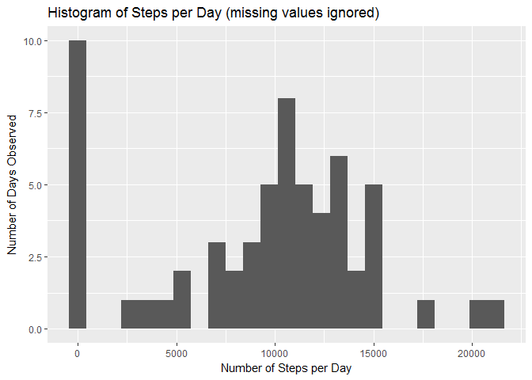
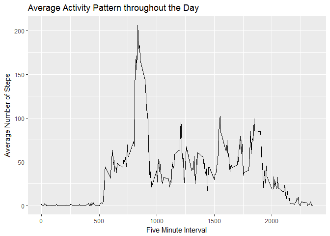
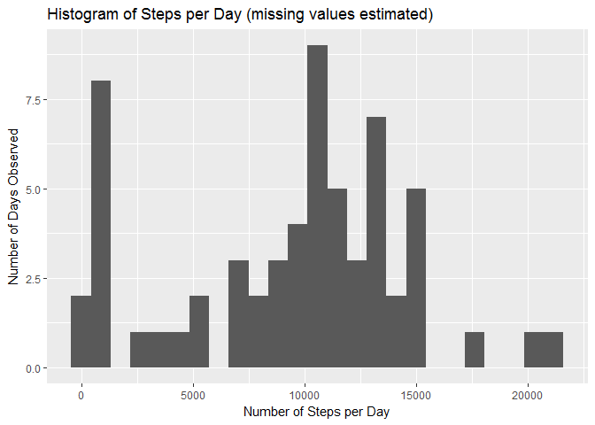
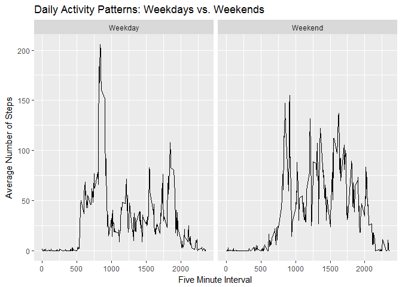

# Reproducible Research: Peer Assessment 1


## Loading and preprocessing the data

 First we will import the file and take a look at it to see if it needs to be re-arranged or pre-processed in any way.

```r
unzip("activity.zip",exdir=getwd())

library(readr)

stepdata <- read_csv("activity.csv")

stepdata
```

```
## # A tibble: 17,568 × 3
##    steps       date interval
##    <int>     <date>    <int>
## 1     NA 2012-10-01        0
## 2     NA 2012-10-01        5
## 3     NA 2012-10-01       10
## 4     NA 2012-10-01       15
## 5     NA 2012-10-01       20
## 6     NA 2012-10-01       25
## 7     NA 2012-10-01       30
## 8     NA 2012-10-01       35
## 9     NA 2012-10-01       40
## 10    NA 2012-10-01       45
## # ... with 17,558 more rows
```

<br>

 The data are already in a suitable format.


## What is mean total number of steps taken per day?

Now we will make a histogram of the total number of steps per day, ignoring missing values.

```r
library(dplyr)

stepperday <- stepdata %>%
     group_by(date) %>%
     summarise(steps = sum(steps, na.rm = TRUE)) %>%
     ungroup()

library(ggplot2)

hist.rmNA <- ggplot(stepperday, aes(steps)) + 
     geom_histogram(bins = 25) +
     labs(title = "Histogram of Steps per Day (missing values ignored)",
          x = "Number of Steps per Day",
          y = "Number of Days Observed")

mean = round(mean(stepperday$steps, na.rm = TRUE), digits = 2)
median = median(stepperday$steps, na.rm = TRUE)

hist.rmNA
```

<!-- -->

<br>

 The mean number of steps per day is 9354.23 and the median number of steps per day is 10395.

## What is the average daily activity pattern?

Now we will look at the average daily activity pattern.

```r
stepperint <- stepdata %>%
     group_by(interval) %>%
     summarise(steps = mean(steps, na.rm = TRUE)) %>%
     ungroup()

activpat <- ggplot(stepperint, aes(interval, steps)) +
     geom_line() +
     labs(title = "Average Activity Pattern throughout the Day",
          x = "Five Minute Interval",
          y = "Average Number of Steps")

max = stepperint$interval[stepperint$steps == max(stepperint$steps)]

activpat
```

<!-- -->

<br>

 Interval 835, containing the greatest number of steps on average, was the most active interval.


## Imputing missing values

 Let's count how many missing values we have:

```r
totalna = count(stepdata, is.na(steps))
totalna = totalna$n[2]

percentna = round(totalna/nrow(stepdata) * 100)
```

<br>

 There are many time intervals in the data set that are missing the number of steps taken. The total number of missing values is 2304 which accounts for about 13 percent of all the observations in the data set.
 
 In an attempt to improve the data slightly, we will replace all missing values with the median number of steps taken during that time interval over all days.


```r
stepperint <- stepdata %>%
     group_by(interval) %>%
     summarise(steps = median(steps, na.rm = TRUE)) %>%
     ungroup()

na.replacer = function(data, indices){
     
     i = 0
     for(index in indices){
          i = i + 1
          if(index){
               data$steps[i] = 
                    filter(stepperint, interval == data$interval[i])$steps
          }
     }
     
     rm(i)
     return(data)
}


na.indices = is.na(stepdata$steps)

na.replaced <- na.replacer(stepdata, na.indices)

rm(na.indices)

na.replaced
```

```
## # A tibble: 17,568 × 3
##    steps       date interval
##    <int>     <date>    <int>
## 1      0 2012-10-01        0
## 2      0 2012-10-01        5
## 3      0 2012-10-01       10
## 4      0 2012-10-01       15
## 5      0 2012-10-01       20
## 6      0 2012-10-01       25
## 7      0 2012-10-01       30
## 8      0 2012-10-01       35
## 9      0 2012-10-01       40
## 10     0 2012-10-01       45
## # ... with 17,558 more rows
```

<br>

 Now that we have imputed the missing values we will recreate the histogram of the total number of steps per day and see if it is very different from the histogram we created previously (in which we just ignored all the missing values).


```r
stepperday.imNA <- na.replaced %>%
     group_by(date) %>%
     summarise(steps = sum(steps)) %>%
     ungroup()

hist.imNA <- ggplot(stepperday.imNA, aes(steps)) + 
     geom_histogram(bins = 25) +
     labs(title = "Histogram of Steps per Day (missing values estimated)",
          x = "Number of Steps per Day",
          y = "Number of Days Observed")

mean = round(mean(stepperday.imNA$steps), digits = 2)
median = median(stepperday.imNA$steps)

hist.imNA
```

<!-- -->

<br>

 The histogram actually looks pretty similar to the histogram in which missing values were ignored, although there is some difference on the left tail. The mean number of steps increased slightly, to 9503.87, but the median remained unchanged at 10395.
 

## Are there differences in activity patterns between weekdays and weekends?

Now we will look to see if there is a difference in activity patterns between weekdays and weekends.
 

```r
# Create function for classifying days
day.classifier = function(date){
     if(weekdays(date) %in% c("Saturday", "Sunday")){
          class = "Weekend"
     }
     else{
          class = "Weekday"
     }
     return(class)
}

# Classify days
for(i in 1:nrow(na.replaced)){
     na.replaced[i,"day.class"] = day.classifier(na.replaced$date[i])
}

# Convert to factors
na.replaced$day.class = factor(na.replaced$day.class, levels = c("Weekday", "Weekend"))

# Get average steps per interval
stepperint.imNA <- na.replaced %>%
     group_by(interval, day.class) %>%
     summarise(steps = mean(steps)) %>%
     ungroup()

# Plot the activity patterns
activpat2 <- ggplot(stepperint.imNA, aes(interval, steps)) +
     geom_line() +
     facet_wrap(~day.class) +
     labs(title = "Daily Activity Patterns: Weekdays vs. Weekends",
          x = "Five Minute Interval",
          y = "Average Number of Steps")

activpat2
```

<!-- -->

<br>

 There does appear to be a difference in activity patterns between weekdays and weekends. There is a greater spike in activity between the 750 and 1000 minute intervals during weekdays. On weekends there appears to be more consistent activity between the 750 and 1750 minuter intervals.
 
